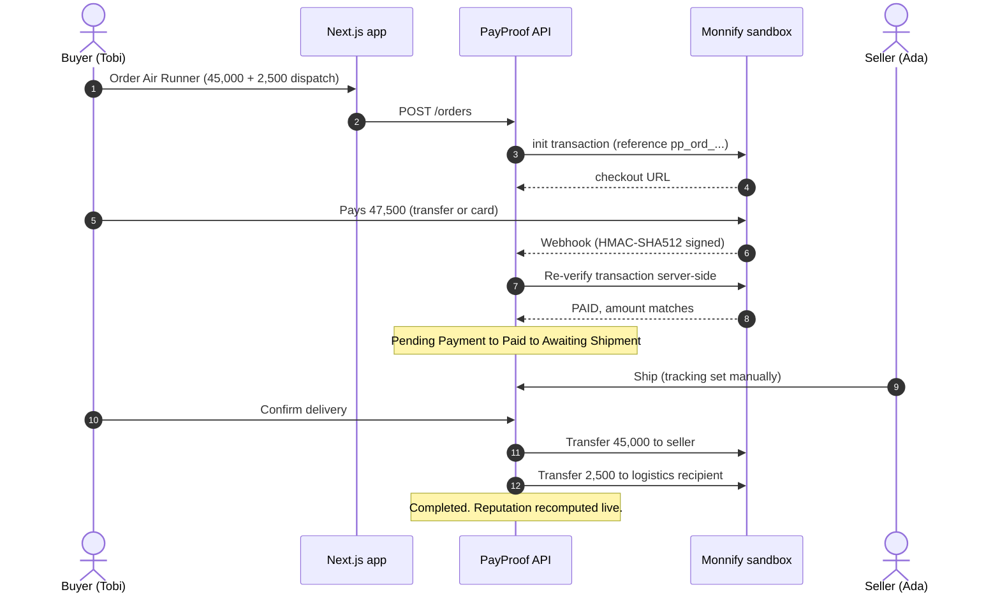
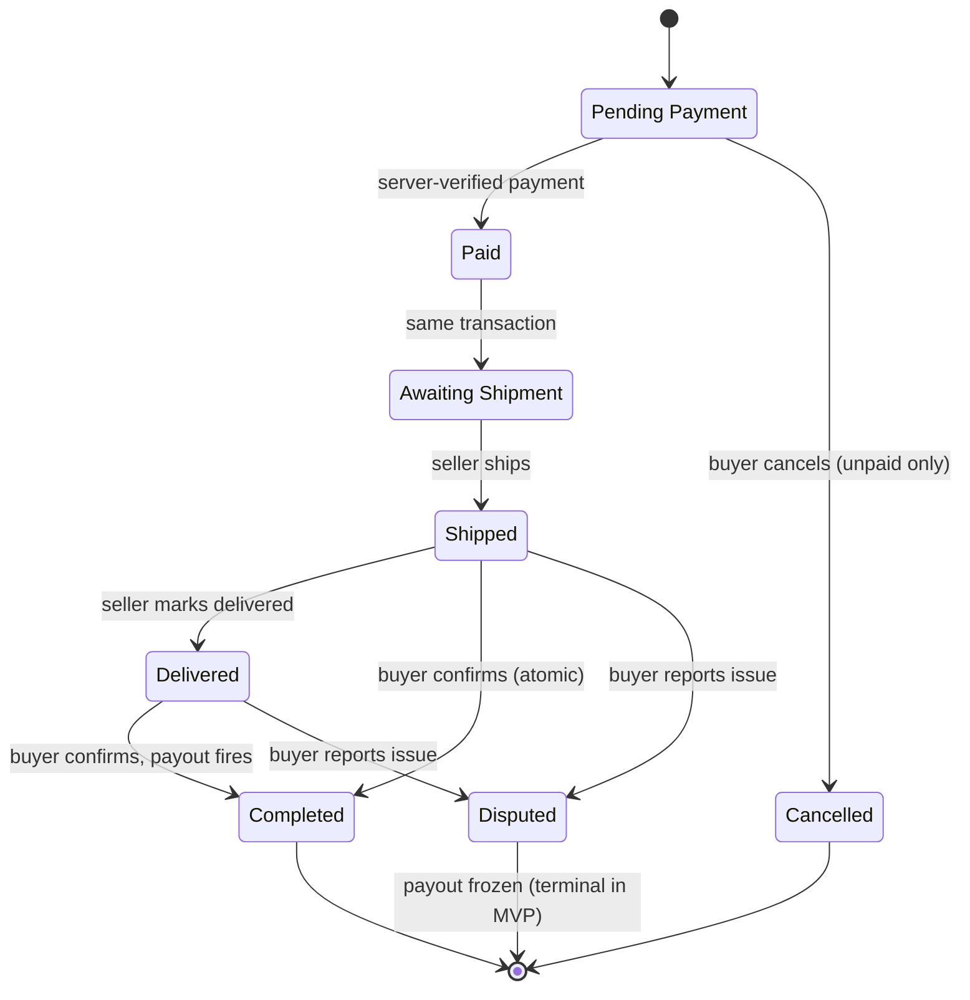

<!-- PLACEHOLDERS IN THIS FILE: 10 images (P1–P10) + 3 text slots (T1–T3). Search "PLACEHOLDER" to find each. -->
<div align="center">

<!-- PLACEHOLDER P1/10 · docs/assets/banner.png · 1600×500 -->


# PayProof

**Screenshots can be faked. Bank records can't.**

Escrow for chat commerce. The buyer pays the product price **and** the dispatch fee into escrow.
Nothing moves until the buyer confirms delivery. Then the seller and the logistics recipient are paid in two separate transfers.

[**Live app**](https://payproof-seven.vercel.app) · [**Demo video**](PLACEHOLDER-T1-VIDEO-URL) · [**Judge guide**](docs/JUDGE-GUIDE.md) · [**Architecture**](docs/ARCHITECTURE.md) · [**API**](docs/API.md) · [**Survey research**](docs/RESEARCH.md)

     

</div>

> **Sandbox build.** All money movement runs on the Monnify **sandbox**. No real funds move. See [What's real vs seeded vs manual](#whats-real-vs-seeded-vs-manual) before judging any claim.

---

## TL;DR

| | |
|---|---|
| **Problem** | In Nigerian social commerce, buyers fear paying first; sellers refuse to ship first. Fake transfer screenshots and vanishing riders kill sales. |
| **Fix** | Verified payment + escrow of product price **and** dispatch fee + buyer-confirmed release. |
| **Differentiator** | The dispatch fee is escrowed and paid out as its **own transfer**. Nobody else treats it as a first-class money line. |
| **Proof it works** | Live on Vercel + Supabase + Monnify sandbox. Payment confirmed **server-side** (webhook never trusted). Reputation computed live from order rows. 44 unit tests + Postman contract suite + CI secret scan. |
| **Research** | 26-person survey of Nigerian buyers and sellers ([results](docs/RESEARCH.md)). |

---

## The problem

In the chat, everyone has proof. Nobody has money.

- *"I've sent it, check the screenshot."* The transfer never happened.
- *"The rider is on his way, send the dispatch fee."* Goods leave against payment that was never real.
- *"Payment made. Seller gone."* Transfers don't reverse, and deleted chats don't testify.

**Ada** sells sneakers on Instagram. She loses sales because buyers won't pay first, and she won't ship on a screenshot.
**Tobi** wants the sneakers. He's been burned before, and he refuses to wire ₦2,500 of delivery money to a stranger.

From our survey of 26 Nigerian shoppers and vendors: **7 of 7 sellers demand full payment before dispatch; 5 of 19 buyers have lost money or received bad goods with no refund; the other 14 stay permanently cautious.** ([details](docs/RESEARCH.md))

---

## How it works

1. **Seller shares a PayProof link** (storefront or invoice) in the chat. On signup she gets a real reserved account (her settlement identity).
2. **Buyer pays at a hosted Monnify checkout**, product price + dispatch fee, by card or bank transfer. PayProof independently re-verifies the payment with Monnify before anything changes.
3. **Seller ships; buyer confirms.** On **Confirm Delivery**: product price → seller, dispatch fee → logistics recipient. On **Report Issue**: payout freezes.



### Order state machine



---

## See it

<!-- PLACEHOLDER P10/10 · docs/assets/demo.gif · ≤ 6 MB · 15–25 s loop: confirm delivery → badge flips 67% → 70% -->


| | |
|---|---|
| <!-- PLACEHOLDER P3/10 --> <br>**Public storefront** · reputation computed from real orders | <!-- PLACEHOLDER P4/10 --> <br>**Seller dashboard** · reserved account + order counts |
| <!-- PLACEHOLDER P5/10 --> <br>**Shareable invoice** · send the link in the chat | <!-- PLACEHOLDER P6/10 --> <br>**Hosted checkout** · price + dispatch fee shown separately |
| <!-- PLACEHOLDER P7/10 --> <br>**Order page** · live timeline + order-scoped assistant | <!-- PLACEHOLDER P8/10 --> <br>**Buyer controls** · confirm or freeze |
| <!-- PLACEHOLDER P9/10 --> <br>**Payout breakdown** · two transfers, honest statuses | |

---

## Features

| Feature | What it does | Status |
|---|---|---|
| Seller reserved account | Real Monnify reserved account created at signup; the seller's settlement identity | `LIVE` (sandbox) |
| Hosted checkout by order reference | Per-order dynamic pay-in account; matches payment to order reliably | `LIVE` (sandbox) |
| Server-side payment verification | Signature check **and** independent `verifyTransaction()`; amount + currency must match | `LIVE` |
| Escrow + dispatch-fee split | Two transfers on release: product → seller, dispatch → logistics recipient | `LIVE` (sandbox) |
| Order state machine | 7 states, guarded transitions, `409 INVALID_TRANSITION` on illegal moves | `LIVE` |
| Confirm delivery / Report issue | Buyer releases funds or freezes the payout | `LIVE` |
| Manual tracking | Seller updates status; UI says *"Manually updated by seller"* | `MANUAL` |
| Live reputation badge | `Completed ÷ (Completed + Cancelled + Disputed)` from order rows, never cached | `LIVE` |
| Rule-based fraud flag | Order total deviates >50% from seller's completed average. Informational only, never blocks | `LIVE` |
| Shareable invoices | Seller issues a link; payment spawns a normal escrowed order. 1 item × qty 1 | `LIVE` |
| Order-scoped AI assistant | Gemini answers questions about **one** order from a JSON snapshot. No tools, no writes | `LIVE` |
| Email OTP auth | One sign-in form for both roles, 6-digit OTP via SMTP | `LIVE` |
| Real-time order updates | Client polls every 5 s (10 s in background tab), stops at terminal states | `LIVE` |

---

## What's real vs seeded vs manual

| Claim | Reality |
|---|---|
| Money | **Monnify sandbox only.** No real funds. |
| Seller reserved account | `LIVE`: real sandbox API call. It is the seller's settlement identity, **not** where buyers pay. |
| Buyer payment | `LIVE`: pays into a per-order dynamic account on Monnify's hosted checkout (card or bank transfer). |
| Escrow custody | Funds sit in PayProof's **Monnify merchant wallet** until release. A production version would need a licensed custody arrangement. Out of scope here. |
| Payment verification | `LIVE`: HMAC-SHA512 over the raw body, then an independent server-side `verifyTransaction()`. The webhook body alone never moves an order. |
| Seller payout | `LIVE` (sandbox): to the seller's settlement account; falls back to her reserved account if unset. |
| **Dispatch-fee payout** | **No courier partner is integrated.** The transfer goes to a **team-controlled proxy account in the sandbox** (labelled "PayProof Logistics"). If that destination is unconfigured or rejected, the fee is marked **`HELD`** and shown as such in the UI. Both outcomes are disclosed, not hidden. |
| Delivery tracking | `MANUAL`: set by the seller. Not pulled from a courier API. |
| Reputation | `LIVE` query. Demo seller **Ada Kicks** starts from **9 seeded historical orders** (6 completed, 2 cancelled, 1 disputed = 67%). New orders move it. Seeded rows are marked `seed`. |
| Fraud flag | Rule-based arithmetic. **Not ML.** Labelled "Rule-based". |
| AI assistant | Read-only, single-order, never claims to verify payments. Fraud flag is never called "AI". |
| OTP | Live SMTP email. Demo mode shows the code in a card banner instead. |

---

## Why not just…

| | Chat + screenshot | Plain bank transfer | **PayProof** |
|---|---|---|---|
| Proof of payment | Editable image | Seller checks own app; buyer trusts seller | **Server-verified against the payment rail** |
| Dispatch fee | Sent to seller, lost on no-show | Same | **Escrowed; separate transfer on release** |
| Seller paid when | Before shipping (buyer's risk) | Before shipping | **After buyer confirms** |
| Reputation | Screenshots of reviews | None | **Computed from real order rows** |
| If something's wrong | Argue in the chat | Argue in the chat | **Payout freezes** |

---

## Architecture

<!-- PLACEHOLDER P2/10 · docs/assets/architecture.svg · 1600×900 · see docs/ARCHITECTURE.md for node list -->


| Layer | Technology |
|---|---|
| App + API | Next.js (App Router, TypeScript), API as route handlers under `/api/v1`, one Vercel deployment |
| Database | Postgres on Supabase via Prisma (11 models). Pooled app connection, direct connection for migrations |
| Payments rail | Monnify sandbox: reserved accounts, hosted checkout, verify, single disbursements |
| State / limits | Upstash Redis: rate limits + idempotency locks |
| Email | SMTP (nodemailer) for OTP |
| AI | Gemini (`gemini-3.8-flash`, fallback `gemini-3.5-flash`) |
| UI | Tailwind CSS + Radix primitives |
| Quality | Vitest, Postman contract suite, GitHub Actions CI, gitleaks |

Design rules: **integer kobo everywhere**; **state transitions in one guarded function**; **the rail is behind an interface** (`createReservedAccount`, `initializeTransaction`, `verifyTransaction`, `initiatePayout`, `verifyWebhookSignature`); **webhook body is never trusted**. Full detail: [docs/ARCHITECTURE.md](docs/ARCHITECTURE.md).

---

## Security and integrity

- Authorization is enforced in the API (owner/party checks, tested 403s). The database is a second layer: least-privilege `payproof_app` role, RLS on all tables, `PUBLIC CREATE` revoked.
- `GET /products` is tenant-scoped (`seller_id` required) after we found and fixed an unscoped inventory leak.
- Payout guards: unique transfer reference per (order, recipient), re-check of `Completed` and no dispute in history, idempotency locks.
- CI runs gitleaks, type-check, Vitest and Prisma validation on every PR.

More: [docs/SECURITY.md](docs/SECURITY.md) · [docs/TESTING.md](docs/TESTING.md)

---

## Try it

**Fastest (no signup):** open the live app → Ada Kicks' public storefront → read the reputation badge.
**Full loop (~5 min):** follow the [Judge guide](docs/JUDGE-GUIDE.md).

### Run locally

```bash
git clone https://github.com/Kvngsw/payproof.git && cd payproof
npm install
cp .env.example .env.local      # fill Monnify sandbox, Supabase, JWT_SECRET, SMTP, Gemini keys
npx prisma generate && npm run dev
```

Env variables (names, purpose, failure modes): [docs/ARCHITECTURE.md#environment](docs/ARCHITECTURE.md#environment).

---

## API at a glance

31 endpoints under `/api/v1` (plus the Monnify webhook), role-scoped, JSON, kobo amounts.

| Area | Endpoints |
|---|---|
| Auth | register (seller/buyer), login, OTP request/verify, `me` (GET/PATCH) |
| Catalog | list (seller-scoped), get, create, update, delete |
| Orders | create, list, get, verify, ship, tracking, confirm-delivery, report-issue, cancel, payout, assistant |
| Sellers | public reputation, private dashboard |
| Invoices | list, create, get (public), cancel |
| System | health, `POST /api/monnify/webhook` |

Full reference: [docs/API.md](docs/API.md).

---

## Research behind it

26 respondents (19 buyers, 7 sellers), 21–30 Sep 2026. Headline findings:

| Finding | Number |
|---|---|
| Sellers who demand full payment before dispatch | **7 / 7** |
| Buyers who lost money or got bad goods with no refund | **5 / 19** (the rest: always cautious) |
| Sellers who want the buyer to pay delivery upfront | **4 / 7** |
| Buyers who say verified logistics makes them trust escrow more | **15 / 19** |
| Buyers whose decisive trust feature is instant refund on non-shipment | **14 / 19** |
| Sellers who said **no** to escrow | **0 / 7** (2 yes, 5 "depends") |

Small convenience sample; directional, not statistically representative. Method and caveats: [docs/RESEARCH.md](docs/RESEARCH.md).

---

## What doesn't work yet

| Gap | Note |
|---|---|
| No auto-refund / auto-cancel for paid orders that never ship | Funds stay held. **#1 survey ask**, top of the roadmap |
| No auto-release if a buyer never confirms | No timers in MVP |
| Disputes are terminal | Payout stays frozen; no resolution flow |
| No courier API | Tracking is manual; dispatch transfer goes to a sandbox proxy or is `HELD` |
| Cancelled (unpaid) orders count against seller reputation | Known limitation; cancel-reason tracking is roadmap |
| One item × one unit per order and invoice | No cart |
| Sandbox only; no licensed custody | Real money would need a regulated escrow partner |

## Roadmap

Full list with rationale: [docs/ROADMAP.md](docs/ROADMAP.md).

1. **Auto-refund SLA timer** for orders that never ship.
2. **Doorstep release code** the buyer gives the rider after inspecting the parcel.
3. **Seller CRM and business analytics**: income and growth over time, repeat customers, top products, customer history and follow-up.
4. **Buyer spending insights**: spend by period and category, and a list of preferred merchants.
5. Courier integration (Shipbubble first) behind the existing tracking interface.
6. Dispute resolution flow; platform fee model (proposed: deducted from seller payout).

---

## Team

| | Name | Role | GitHub |
|---|---|---|---|
|  | **Oluwamakinde Oluwole-Ojo** | Product Lead · Integration & QA | [@kvngsw](https://github.com/kvngsw) |
|  | **Richard Ilori** | Backend Lead · Rail & Payments | [@hiamrhex](https://github.com/hiamrhex) |
|  | **Imran Ogungbayi** | Frontend Lead · Interface Systems | [@xpektra7](https://github.com/xpektra7) |

**What each of us built**

- **Oluwamakinde**: the product decisions and the API contract (28 endpoints, 27 logged rulings), the Postman contract suite, CI secret scanning, branch protection, production seeding, the customer survey, and end-to-end verification on the live deployment.
- **Richard**: Monnify integration (reserved accounts, checkout, verification, payouts), signature-verified webhook, the transactional state machine, the 11-model Prisma schema, least-privilege database roles, tenant scoping.
- **Imran**: the client across 12 routes, unified sign-in + OTP, live order polling, honesty labels, invoice flow, assistant UI, the design system.


---

## Docs

| Doc | For |
|---|---|
| [Judge guide](docs/JUDGE-GUIDE.md) | Test the product in 2 / 5 minutes |
| [Architecture](docs/ARCHITECTURE.md) | Stack, flows, state machine, data model, env |
| [API reference](docs/API.md) | Every endpoint |
| [AI assistant](docs/AI-ASSISTANT.md) | Prompt, guardrails, 12-question test results |
| [Security](docs/SECURITY.md) · [Testing](docs/TESTING.md) | Controls and evidence |
| [Research](docs/RESEARCH.md) | Survey method and findings |
| [Roadmap](docs/ROADMAP.md) | What's next |
| [Decision log](docs/decision-log.md) | Why things are the way they are |

---

Built for the **StacStart 2026 Career Summit Hackathon** · Fintech Track.
MIT License © 2026 PayProof Team
