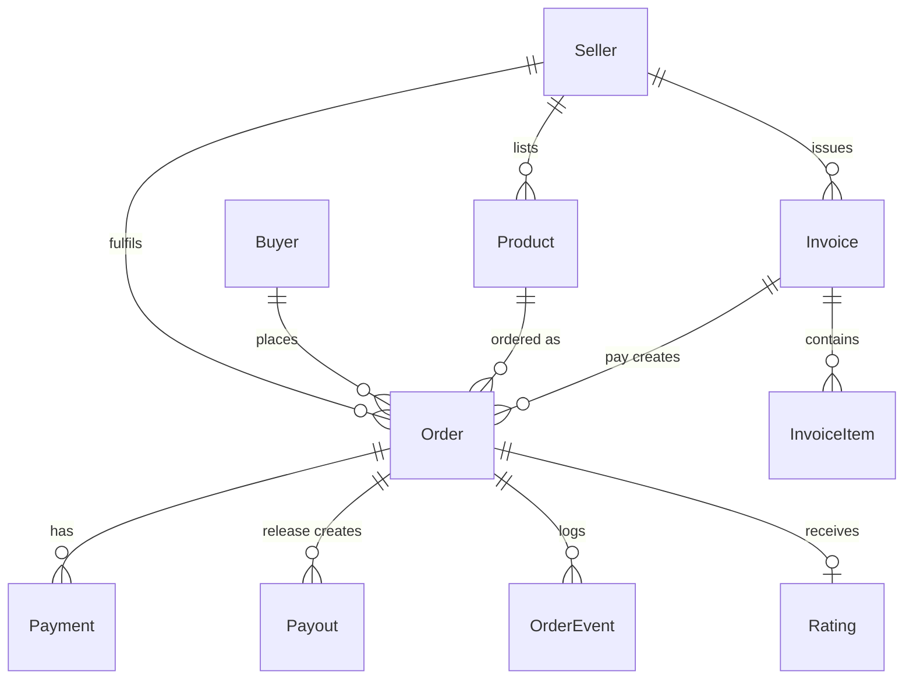

# PayProof — Architecture

*Verified against commit `a7bd6ef`, 2026-09-30. Production: https://payproof-seven.vercel.app*

## 1. Topology

| Component | Choice | Notes |
|---|---|---|
| Web + API | Next.js App Router on Vercel | API = route handlers `app/api/v1/**`; one deployment, no separate backend. All handlers `force-dynamic` |
| DB | Supabase Postgres | Pooled (PgBouncer, 6543) for app; direct (5432) for migrations |
| Rail | Monnify sandbox | Reserved accounts, hosted checkout, verify, single disbursement |
| Cache / limits | Upstash Redis | `ratelimit:*` (auth 5/min, products 30/min), `idempotency:*` locks |
| Email | SMTP via nodemailer | Live OTP delivery |
| AI | Gemini `gemini-3.8-flash`, fallback `gemini-3.5-flash` | Order-scoped, 300 max tokens, 10 s timeout |
| Runtime | Node 20, Function timeout 15 s | Webhook responds fast |

### Diagram brief (for `docs/assets/architecture.svg`)

Nodes: Buyer, Seller, Next.js web (Vercel), API route handlers (same app), Postgres (Supabase), Upstash Redis, Monnify sandbox, SMTP, Gemini.
Edges: Web → API (poll order every 5 s); API → Postgres; API → Redis (rate limit, idempotency); API → Monnify (auth, reserved account, init, verify, disburse ×2); Monnify → API (signed webhook → re-verify); API → SMTP (OTP); API → Gemini (order snapshot only); disburse → Seller settlement account, Logistics recipient (sandbox proxy or `HELD`).

## 2. Money flow (plain English)

1. Buyer pays the **total** (product + dispatch) at Monnify's hosted checkout, into a **per-order dynamic account**, keyed by `pp_ord_…` reference.
2. Funds sit in PayProof's **Monnify merchant wallet** (`MONNIFY_WALLET_ACCOUNT_NUMBER`). This is the escrow. Sandbox only.
3. On **Confirm Delivery** `release()` fires two disbursements: `payout_{orderId}_seller` (product) and `payout_{orderId}_logistics` (dispatch).
4. The seller's **reserved account** is her settlement identity. It is not the buyer's payment target (decision D1).

### Payout destinations

| Transfer | Destination | Fallback |
|---|---|---|
| Seller | Seller's settlement account (`PATCH /auth/me`) | Her Monnify reserved account |
| Logistics | Team-controlled **sandbox proxy** ("PayProof Logistics") from `LOGISTICS_*` env | If unset or rejected → `HELD` (disclosed in UI, payout `partial`) |

No courier partner is integrated (decisions D18, D26).

Invariant (unit-tested): `sellerKobo + logisticsKobo === total_kobo`. No platform fee in MVP.

### Payout statuses

| Payout | Meaning |
|---|---|
| `none` / `pending` | Not yet released |
| `paid` | Both transfers succeeded |
| `partial` | Seller paid; logistics `HELD` or failed |
| `frozen` | Dispute raised; nothing fires |
| `failed` | Release failed |

## 3. Webhook (`POST /api/monnify/webhook`, re-exported at `/api/v1/monnify/webhook`)

1. Read **raw body** (`req.text()`); compute HMAC-SHA512 with the Monnify secret; compare to `monnify-signature` header. Bad → `401 BAD_SIGNATURE`.
2. Respond `200` fast; ignore unknown references; duplicates on non-pending orders are no-ops.
3. **Never trust the body**: call `verifyTransaction(reference)`.
4. Require status PAID, `amount == order.total_kobo`, currency NGN. Mismatch → stay `Pending Payment`, note `PAYMENT_MISMATCH`.
5. One DB transaction: payment row → stock decrement → `Paid` → `Awaiting Shipment` → fraud rule → events.

## 4. State machine

| From | To | Actor | Trigger | Guard |
|---|---|---|---|---|
| Pending Payment | Paid | system | webhook / E15 | verified, amount matches |
| Paid | Awaiting Shipment | system | same txn | none |
| Awaiting Shipment | Shipped | seller | E17 | owner; tracking = Picked Up |
| Shipped | Delivered | seller | E18 | owner; forward-only |
| Shipped / Delivered | Completed | buyer | E19 | owner; not Disputed; no prior payout → `release()` |
| Shipped / Delivered | Disputed | buyer | E20 | owner; reason ≤500 chars → payout frozen |
| Pending Payment | Cancelled | buyer / system | E24 | unpaid only |
| any other | — | — | — | `409 INVALID_TRANSITION` |

E19 from `Shipped` performs `Shipped → Delivered → Completed` atomically, two events.

## 5. Reputation and fraud

```
score = Completed / (Completed + Cancelled + Disputed)    // in-flight excluded; null if no finished orders
badge = `${Math.round(score*100)}% completed`
```

Demo trajectory (Ada Kicks, live): 6/9 → **67%** · +1 completed 7/10 → **70%** · +1 disputed 7/11 → **64%**.

Fraud rule: `|total − avg(completed totals)| / avg > 0.5` → flagged. Fewer than 3 completed → `insufficient_history`. Informational, never blocks, labelled "Rule-based".

## 6. Data model (11 Prisma models)

`Seller` · `Buyer` · `Product` · `Order` · `Payment` (unique reference) · `Payout` (unique `transferRef`) · `OrderEvent` · `Invoice` · `InvoiceItem` · `Rating` · `OtpCode` (hashed, expiry, attempts).

Money columns are integer kobo. Defaults: `dispatchFeeKobo = 250000` (₦2,500), `deliveryDays = 3` (decision D20).



## 7. Frontend

12 routes, Tailwind + Radix. `STATUS_DISPLAY` shim maps backend status strings to spaced labels. Data source switch: `NEXT_PUBLIC_DATA_SOURCE` = `live` (production default) or `mock`. Polling: 5 s active / 10 s hidden tab, stops at `Completed`, `Cancelled`, `Disputed`.

Runtime honesty labels (driven by backend fields, never hardcoded): `tracking.source = manual` → "Manually updated by seller"; `fraud_flag.label` → "Rule-based"; `verification_mode = cached_fallback` → delayed-verification banner.

| Status | Chip colour |
|---|---|
| Pending Payment | slate |
| Paid / Awaiting Shipment | blue `#2563EB` |
| Shipped | amber `#F59E0B` |
| Delivered | purple |
| Completed / paid | emerald `#10B981` |
| Disputed / frozen | red `#EF4444` |

## 8. Environment

Names only. Values live in Vercel / `.env.local`.

| Variable | Needed for | If missing |
|---|---|---|
| `DATABASE_URL`, `DIRECT_URL` | App pool / migrations | API 500 / migrate fails |
| `JWT_SECRET` | Token signing | Auth 401 |
| `MONNIFY_API_KEY`, `MONNIFY_SECRET_KEY`, `MONNIFY_CONTRACT_CODE`, `MONNIFY_BASE_URL` | Rail + webhook signature | 502 / webhook 401 |
| `MONNIFY_WALLET_ACCOUNT_NUMBER` | Escrow wallet for disbursement | Payout `failed` |
| `LOGISTICS_BANK_CODE`, `LOGISTICS_ACCOUNT_NUMBER`, `LOGISTICS_ACCOUNT_NAME` | Dispatch transfer | Logistics `HELD` |
| `SMTP_HOST`, `SMTP_PORT`, `SMTP_USER`, `SMTP_PASS` | OTP email | Signup fails |
| `GEMINI_API_KEY`, `GEMINI_MODEL`, `GEMINI_FALLBACK_MODEL` | Assistant | Assistant 502 |
| `UPSTASH_REDIS_REST_URL`, `UPSTASH_REDIS_REST_TOKEN` | Rate limits / idempotency | Falls back to in-memory |
| `NEXT_PUBLIC_APP_URL`, `NEXT_PUBLIC_DATA_SOURCE` | Redirects / live-vs-mock | Broken return URLs |
