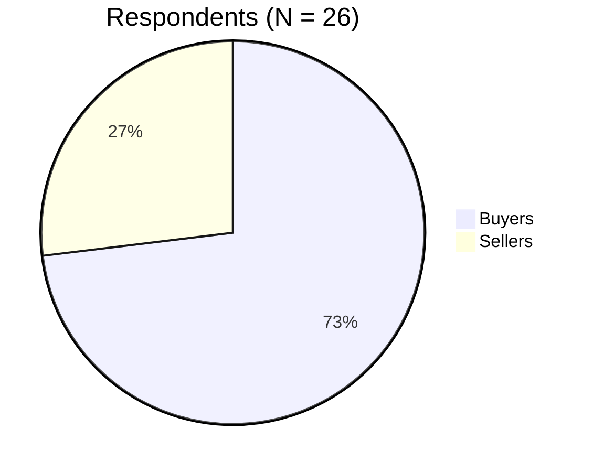

# PayProof — Field Research

**Survey:** Social Commerce Escrow & Logistics Survey (Nigeria) · **N = 26** (19 buyers, 7 sellers) · 21–30 Sep 2026 · run by Oluwamakinde Oluwole-Ojo during the build.
The first 16 responses shaped the dispatch-fee escrow decision; the final 26 are reported here.

> **Caveats.** Small convenience sample (7 sellers). Findings are directional, not statistically representative of Nigerian social commerce. Percentages of 7 move 14 points per respondent.

## Sellers (n = 7)

| Question | Result |
|---|---|
| How do you take payment? | Full payment before delivery **7/7**; pay-on-delivery 0; part payment 0 |
| How do you deliver? | Mix by location 3 · third-party dispatch 2 · in-house riders 1 · buyer pickup 1 |
| Use verified platform logistics? | Yes if instant payout on drop-off 3 · only if cheaper 2 · no, own methods 2 |
| Who pays delivery? | Buyer, 100% upfront **4 (57.1%)** · seller absorbs 3 |
| Would you use escrow? | Definitely 2 · depends on how it works 5 · **no 0** |

## Buyers (n = 19)

| Question | Result |
|---|---|
| Ever scammed? | Cautious, no loss 14 (73.7%) · lost money to fake vendor 4 · wrong/damaged goods, no refund 1 → **5 (26.3%) suffered loss** |
| Does verified logistics change trust? | Faster and safer release 9 · rider lets me verify at doorstep 6 → **15 (78.9%) more trust** · no difference 2 · prefer own courier 2 |
| Fee split? | Buyer pays delivery, seller pays escrow fee **12 (63.2%)** · 50/50 3 · seller pays both 3 · buyer pays both 1 |
| Inspection window? | Inspect at handoff, release immediately **15 (78.9%)** · 2–6 h grace 4 |
| Decisive trust feature? | Instant refund if seller fails to ship **14 (73.7%)** · dispute team 4 · light web app 1 |

## The trilemma

| Party | Wants | Conflict |
|---|---|---|
| Seller | 100% paid before dispatch | Buyer won't pay first |
| Buyer | Protection, inspection at handoff | Won't wire the dispatch fee to a stranger |
| Logistics | Guaranteed payment | Paid only if the deal holds |

Escrowing the **dispatch fee** alongside the price resolves it: the buyer locks both, the seller ships with no capital at risk, the logistics recipient is paid in an isolated transfer.

## Findings → product decisions

| Finding | Decision | Status |
|---|---|---|
| 7/7 sellers need upfront payment | Hosted checkout; payment verified server-side before shipping | Built |
| 57% of sellers want buyer to pay delivery upfront | Dispatch fee escrowed with price, separate `logistics` transfer | Built |
| 2/7 sellers reject mandatory couriers | Manual tracking default, labelled "Manually updated by seller" | Built |
| 15/19 buyers want handoff inspection | One-tap **Confirm Delivery** releases funds | Built (in-app; not rider-code yet) |
| 15/19 say verified logistics builds trust | Live order timeline + honest tracking labels | Built (manual tracking) |
| 14/19 want instant refund on non-shipment | **Not built.** Funds stay held | Roadmap #1 |
| 12/19 prefer seller pays escrow fee | No fee in MVP; proposed seller-side deduction later | Roadmap |
